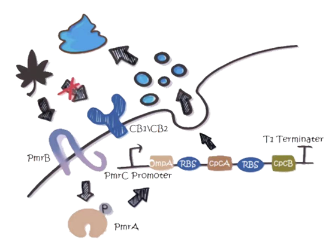
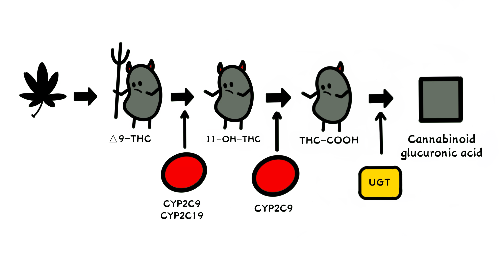

In 2020, the United Nations officially recognized the medical use of cannabis, it allows for much needed research on the pharmacokinetics and pharmocology of medical cannabis. However, the booming usage of cannabis leading by legalization has also created an extraordinarily high risk of drug leakage.

The predominant psychotropic component in cannabis is Δ9-THC. Some traits predispose individuals to the use of psychoactive substances in general. Given the rapid proliferation of cannabis after legalization and the inadequate supervision from society, it is an urgent need to ensure that healthy people stay away from cannabis; while for those who need cannabis for its medical usage, to reduce their dependence on it.

In this project, we developed a new type of intestinal colonization engineered bacteria called **Cannabis "Vaccine"**, aiming at alerting "vaccinators" about the Δ9-THC intake and metabolizing it in the intestine, also with careful assurance on biosafety.

<!-- 
 -->

    

For further details about our biological pathway design and how we model it, please refer to our [project homepage](https://2022.igem.wiki/bnu-china/) and [model part](https://2022.igem.wiki/bnu-china/model).

Our modelling group endeavored to formulate accurate descriptions of each module and their relationship. Specifically, we established mathematical models to describe the system of biochemical reactions for each module based on differential equations, stochastic process and biochemical kinetics, etc. The models were implemented and simulated to explore the feasibility and efficiency of our biological pathway. [^1] According to the results, we discussed with wet-lab fellows to both improve their experiment design and our modelling and simulation. Eventually, the feasibility and efficiency of our project ware validated.

From my perspective, modelling experience in iGEM provided me with an oppportunity to learn to look at problems from an unknown field (e.g., synthetic biology) in a systematic view. Such view allows me to think about unfamiliar, often complex systems first from a highly abstract level, thus formulating general theories or hypotheses to guide my further exploration. And as I delve deeper into such field, more details and deviation from my original highly abstract theories offer ways to modify them, making them more suitable for the problems, i.e., more concrete. After several iterations, my comprehension of the problems can be concrete enough to assist me in solving them. Then it's time for implementation. Even though we failed to achieve gold medal, this would still be an unforgettable, profound piece of memory in my life.

[^1]: You can refer to my repo [BNU-China-2022](https://github.com/HaoyuLu1022/BNU-China-2022) for the codes and part of results. For more info, you can directly contact me via email.